# API Ref style guide
This document serves as a guideline for contributing to the API Reference
documentation for the ArcGIS API for Python. It includes a brief overview
of setting up a conda environment and a workflow for managing Git daily 
to build the API Reference locally. It also includes tips and advice for
efficient work and debugging, and syntax to use in Python docstrings to
add code emphasis and hyperlinks to other portions of the api reference.

## Set up the `conda` environment
1. Clone the geosaurus repo from _https://github.com/arcgis/geosaurus_
2. Navigate to the geosaurus directory:
  `cd path_to_newly_cloned_repo\geosaurus`
3. Create the default environment from configuration file in the repo:
  ```python
  conda env create -f environment.yml
  ```
  * **Note:** Anaconda or Miniconda must be installed on your system to 
  provide access to the `conda` utility. Add the pathway to your installation 
  to run the command above without having to navigate to the install
  directory.
  * The `environment.yml` file in the geosaurus repo contains a list 
  of all dependencies for the API for Python and instructs conda to create
  an environment named `geosaurus_dev_env` and install all the dependencies
  within that environment.
4. Activate the environment:
```python
conda activate geosaurus_dev_env
```
5. Navigate to the API Reference directory in the repo:
`cd docs/api_ref`
6. Build the API Reference locally:
`make html` 
7. Open your file system's browser and navigate to the 
_geosaurus/docs/api_ref/build/html_ directory. Locate the _index.html_ file 
and open it in the web browswer of your choice. You will have a locally
rendered API for Python Reference for you to test out changes you make
to docstrings in your local branch.

## Sample Workflow for editing API Reference

Managing `git` can be confusing, but a daily workflow to
establish consistent code practices will help avoid merge conflicts when
pushing upstream.

Use the following steps to maintain an updated working branch. Make sure
you have activated the `geosaurus_dev_env` so you have access to
the `sphinx` software and `sphinx-rtd-theme` used by the API for Python 
api reference:
```bash
conda activate geosaurus_dev_env
```
1.  Create a working branch for editing documentation
```git
git checkout -b new-working-branch -t upstream/master
```
> This command creates a new branch tracking the upstream repo's
  master branch.
2.  Checkout your local master branch and bring it up to date with the 
upstream repo
```git
git checkout master
```
3.  Download all the records from your upstream repo
```git 
git fetch --all
```
> This command fetches all of the changes from the upstream repository
>that have been made since the last time all records were fetched.

> This command does not merge in the changes and can be
>aborted, unlike *git pull*
4. Check the status and merge if necessary
```git
git status
```
```git
git merge upstream/master
```
5. Checkout your working branch
```git
git checkout new-working-branch
```
6. Edit the docstrings you intend to change and save them
7. Add the changes to your branch
```git
git add paths_to_files_if_necessary
```
> Depending upon your edits, you may need to append specific paths to 
> files after the add command

> `git add .` will add all changes that occur within your current path
8. Build the documentation to inspect the changes you made:
```bash
make html
```
9. Navigate in your file browser to the `geosaurus/docs/api_ref/build/html`
directory in your repo and open the _index.html_ file with your web browser
of choice

## Tips and Suggestions

1.  Always render the local documentation before issuing a pull request
to the repo. This baseline for comparing changes to the current doc will
avoid merge conflicts.

2.  Sphinx is finicky and particular. Small changes to a table or code 
snippet could easily break the corresponding _class_ documentation, 
preventing it from rendering. To avoid hours of debugging, break your
edits into smaller modules of work (10-15 methods depending on length and 
volume of changes\. At a stopping point, save your work (add
changes to your local branch) and render local documentation to ensure 
proper rendering. If something has gone wrong, you will be working with 
a smaller amount of changes to debug.

3.  The search command on your IDE is integral to finding the right methods 
and properties in the source code to verify how and where they render in the 
live document at `https://developers.arcgis.com/python/api-reference`.

4.  When dealing with properties, there are often two similar entries
in the source code: a _getter_ and a _setter_.
  * A getter is decorated with **@property**,  while a setter is decorated 
with **@property.setter**. However, only the docstring of the getter
will be rendered for that specific property. Any changes made to the 
**@property.setter** docstring will be disregarded in the final html output. 
However, both docstrings should be edited for consistency\!

5.  Attention to spacing is **imperative**\! Especially for _notes_, 
_warnings_, _tables_, _return_, and _code-block_ directives. (See below for 
details on these). Make sure that there is a blank space before the start and
at the end of of **every** _note_, _warning_, _table_, and _code-block_.

    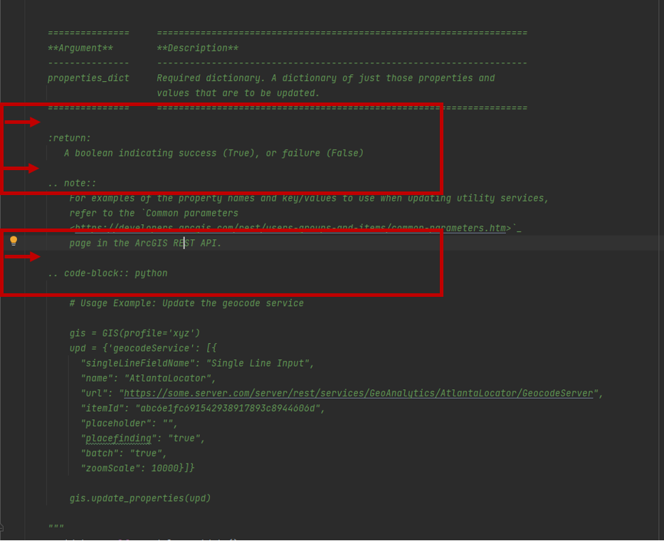

## Customizing Table of Contents with subjective groupings
By default, the sphinx engine lays out all the classes and static functions at the root level of a module. Usually the 
members are sorted alphabetically. However, for a large API, this becomes tedius to navigate or to quickly understand
the layout of that module's members. 

A solution is to customize the `toctree` by introducing subjective groupings. In essence, this overwrites what sphinx
makes by default and puts responsibility on the team **to add new members manually** to the `toc.rst`. See 
https://github.com/ArcGIS/geosaurus/pull/6844/ for pictures and the API ref for `mapping` module once that PR is merged
for examples.

### Making subjective groups
By default, the sphinx toctree looks like this:

```rst
arcgis.mapping module
=================

.. automodule:: arcgis.mapping


OfflineMapAreaManager
-----------------------
.. autoclass:: arcgis.mapping.OfflineMapAreaManager
    :members:
    :undoc-members:
    :show-inheritance:
```
You can change this to:
```rst
arcgis.mapping module
=================

.. automodule:: arcgis.mapping

Working with 2D Maps
--------------------

OfflineMapAreaManager
^^^^^^^^^^^^^^^^^^^^^
.. autoclass:: arcgis.mapping.OfflineMapAreaManager
    :members:
    :undoc-members:
    :show-inheritance:
```
which will group `WebMap`, `OfflineMapAreaManager` and the rest under the group `Working with 2D Maps`. The key is to 
immediately follow a heading with dashed underlines (`Working...Maps` in this case) with another sub-heading with carrot
underlines (`Webmap` in this case). Sphinx will break this group when it encounters another heading with dashed underlines.

As you know sphinx is finicky and this, like the rest would require a bit of tiral and error to ensure the char spacing,
line spacing is not interfering with something sphinx expects.

### Customizing submodules in subjective groups
The example above shows how to group classes and functions. This section shows how to customize the group names for sub-modules.
By default, sphinx calls this as `Submodules` and the toctree looks like below:

```rst
Submodules
--------------
.. toctree::
   :maxdepth: 3

   arcgis.mapping.ogc
   arcgis.mapping.forms
```
You can customize this to look like below:
```rst
Working with OGC layers
-----------------------
arcgis.mapping.ogc
^^^^^^^^^^^^^^^^^^
.. toctree::
   :maxdepth: 3

   arcgis.mapping.ogc

Working with Map Forms
----------------------
arcgis.mapping.forms
^^^^^^^^^^^^^^^^^^^^
.. toctree::
   :maxdepth: 3

   arcgis.mapping.forms
```
You simply repeat the `..toctree::` directive for each item under your group **and in the corresponding toctrees of 
submodules**, you need to **remove** the following:
```rst
arcgis.mapping.forms module
===================

.. automodule:: arcgis.mapping.forms
```
You can, in theory, recursively customize the toctree of submodules to have their own groupings. But I have not tried this
yet.

## Syntax for Code Emphasis and Directives

1. **Text emphasis**
   * Bold
     * docstring:  \*\*Bold Text\*\*
     * api output:  **Bold Text**
   * Italics
     * dostring:    \`Italics\` 
     * api ref output:    *Italics*
   * Highlighted string with a box
     * docstring:    The \`\`GIS\`\` class
       * api ref output:    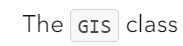
2. **Notes**
   * Use the note directive to start the docstring:
     * .. note::
     * Anything indented on the lines following this directive will be included in the note, until a blank line interrupts the note. Make sure there is blank line between the directive and the previous docstring line.
       * **Docstring**
      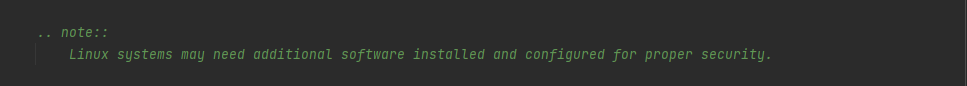
       * **Documentation Outcome**
      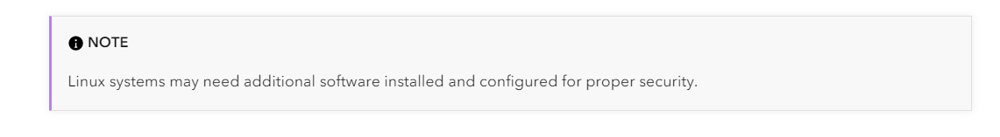
3.  **Warnings**
   * Use the warning directive to start the docstring   
     * .. warning::
      * Anything indented on the lines following this directive will be included in the warning, until a blank line interrupts the warning. Make sure there is blank line between the directive and the previous docstring line.
        * **Docstring**
      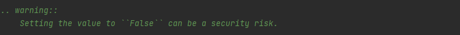
        * **Documentation Outcome**
      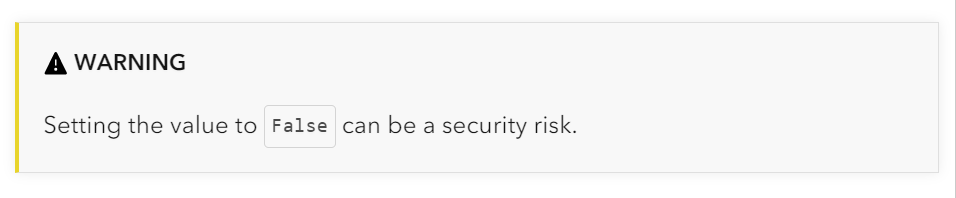
4.  **Hyperlinks**
   * To create a hyperlink, use the following format:
      * \`Hyperlink Text \<www.url.com\>\`\_ **\(do not forget the underscore at the end\!\)**
        * **Docstring**
      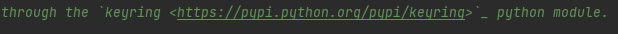
        * **Documentation Outcome**      
      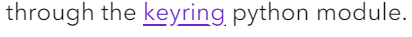
5.  **Cross-references:**
   * Cross-references use text roles and specific syntax to link to another class, method, or property within the API reference documentation. See [Cross-referencing syntax](https://www.sphinx-doc.org/en/master/usage/restructuredtext/roles.html#xref-syntax)
   within the Sphinx documentation for additional details.
   * Cross-references are generated by writing _**:role:\`target\`**_ in the docstring. A link will be created to the item named _target_ of the type indicated by _role_. The link’s text will be the same as target.
     * You may supply specific title and a target, _**:role:\`title \<target\>\`**_. The hyperlink will refer to _target_, but the link text will be _title_
     * If you prefix the _target_ with a \~, the link text will only be the last component of the target
   * Cross-references should be used when appropriate for return values, in docstring summary lines and descriptions, as well as in parameter tables.
     * reference a `Class`:
       * **Docstring syntax**
         * :class:\`\~arcgis.gis._impl.APIKeyManager\`
         
         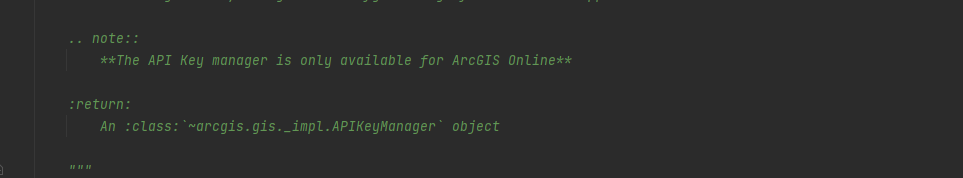

         * the tilde \(\~\) prefixing the full module pathway uses only the last component of the path as link text. The cross-reference will be directly to the class documentation. See the image below for what appears when you hover over a correctly formatted cross-reference. 
       * **Documentation Output**

       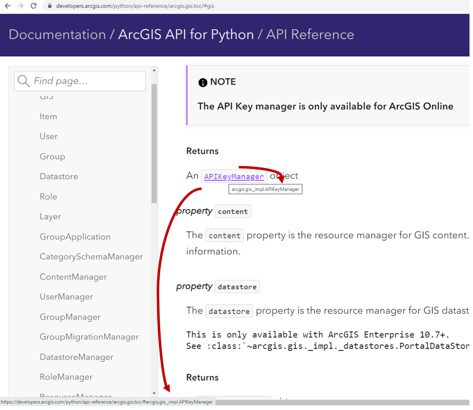
     * options for referencing a `Method` or `Property`:
       * _:attr:_
         * **Docstring syntax**
           * :attr:\`\~arcgis.features.FeatureLayer.append\`
           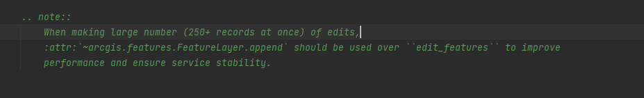
         * **Documentation Output**

           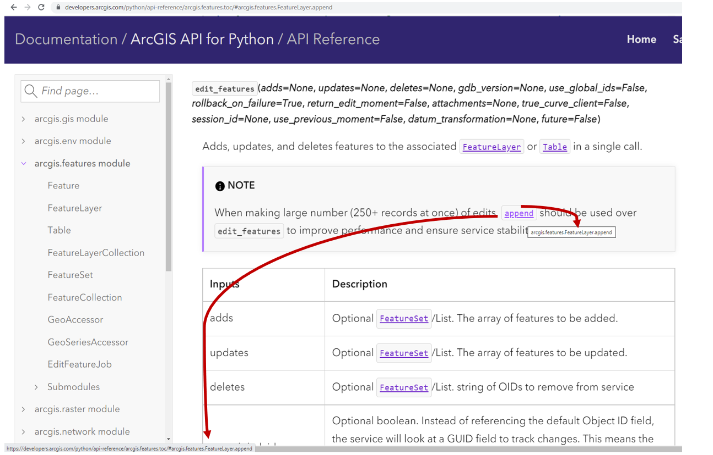
       * _:func:_
         * **Docstring syntax**
           * :func:\`\~ServerManager.list\`
           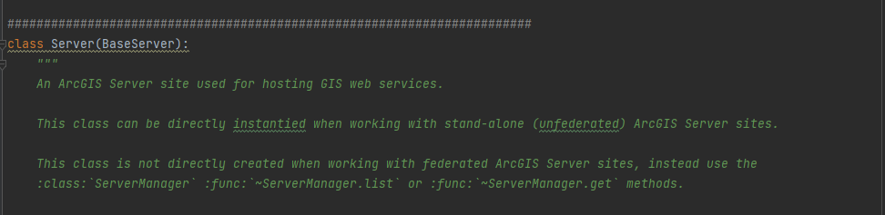
         * **Documentation Output**

           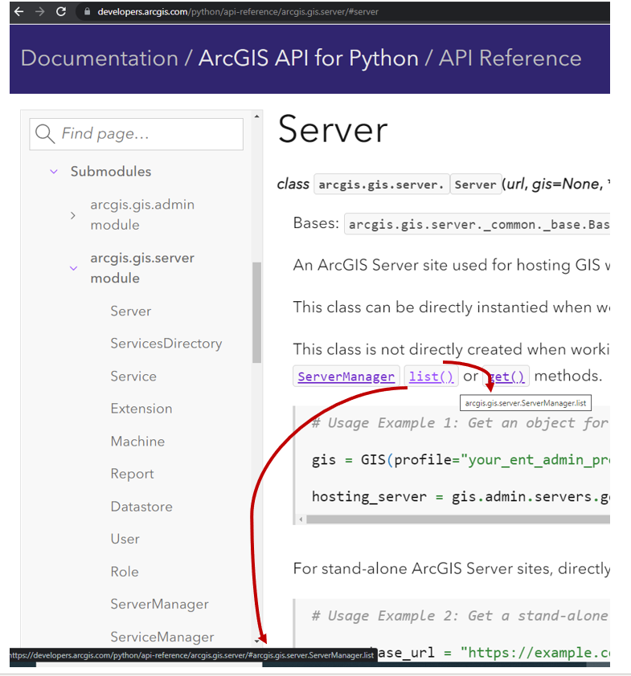
       * _:meth:_
         * **Docstring syntax**
           * :meth:\`arcgis.raster.analytics.is_supported\`
           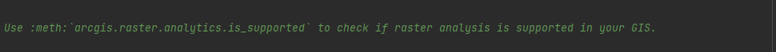
         * **Documentation Output**

           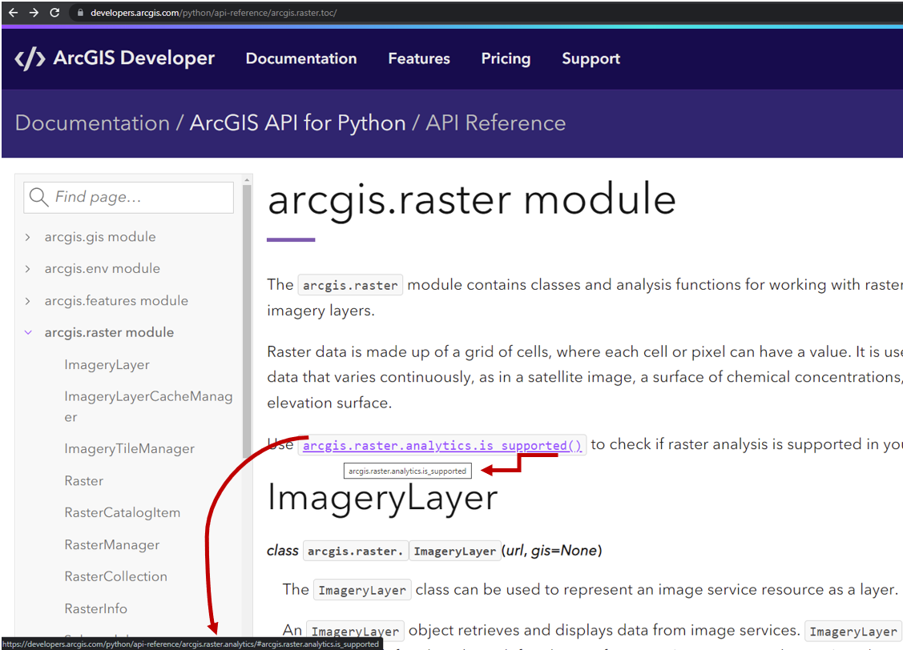

       * Leaving off the \~ directly following the first \` \(backtick\) in the directive syntax renders the entire path rather than just the last component.

6.  **Tables**
  * Tables are helpful for organizing explanations of parameters for functions and class initialization. Sphinx uses `rST` formatting in Python docstrings for creating tables. There are 2 formats for creating [tables](https://docutils.sourceforge.io/docs/ref/rst/restructuredtext.html#tables), [Grid Tables](https://docutils.sourceforge.io/docs/ref/rst/restructuredtext.html#grid-tables]) and [Simple Tables](https://docutils.sourceforge.io/docs/ref/rst/restructuredtext.html#simple-tables). Given the cumbersome nature of creating grid tables, the ArcGIS API for Python API Reference employs the simple table structure in docstrings.
  * Tables syntax is quite finicky. Details are crucial and require careful attention when editing. Stringent spacing and line length requirements make mistakes likely, even probable.
    * Basic instructions
      * To create the top and bottom horizontal borders of a table, use “=” character. 
      * To delimit rows of the table, use the “-“ (hyphen-minus) character.
      * To designate the start of a new column, use one or more blank spaces. Two or more spaces are recommended. The Python API Reference docstrings typically use 4 or 5 spaces between column boundaries. There **MUST** be at least 2 two columns in a table.
      * The column spacing **MUST** align throughout the whole table or the table will not render. (See red rectangle below.)
      * **ALL** text **SHOULD** align exactly with the column boundaries. Although the rightmost column is unbounded so if text
      bleeds beyond the boundary the table will still render, it is strongly encouraged to start a new line if text will bleed. (See green rectangle below.)
        * The exception to this rule is _hyperlink_ text as the full url cannot be split upon multiple lines.
      * **Sample Table from Docstring**
    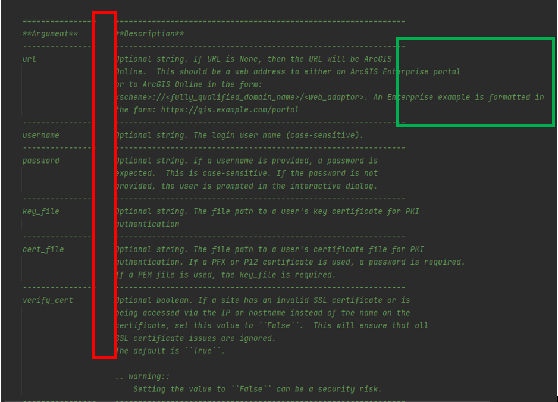
      * **Documentation Output**       
    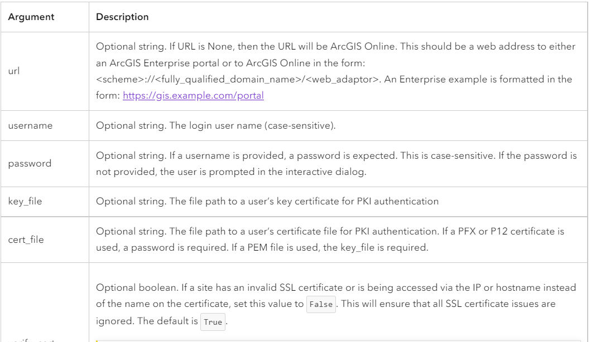
        
7.  **Code Block**
  * Use the code block directive to insert code snippets, either within parameter tables to illustrate parameter options, or after a docstring
  * **Docstring Syntax**   .. code-block:: python
    * Renders as a code snippet similar to the core Python library documentation.
    * Start actual code lines a user will type with the \>\>\> prompt, which will render highlighting for Python reserved words \(the snippet looks more like it is actual code rather than a snippet in a docstring\)
  * **Docstring example**
    * within a parameter table cell:
      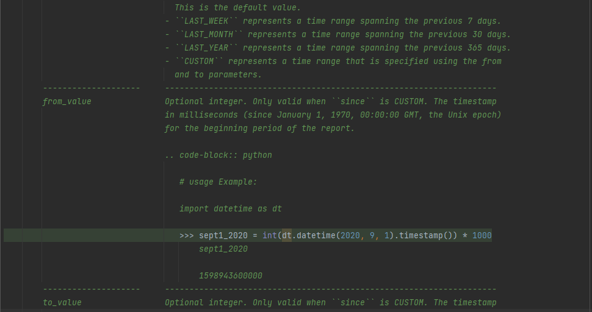
      * **Documentation output**
      
      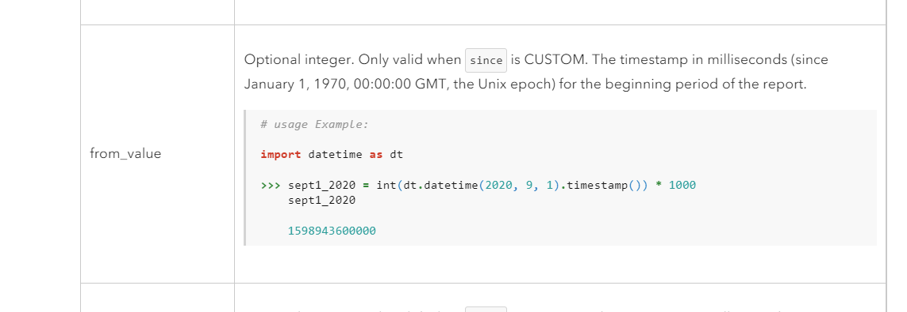
    * after a docstring
      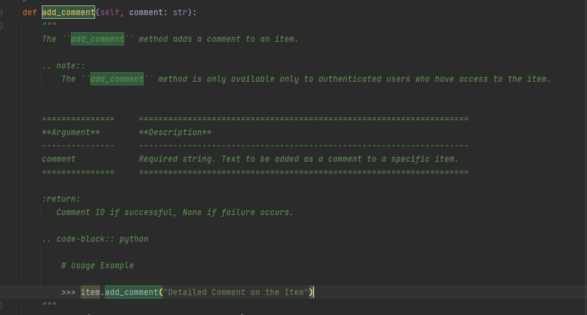
      * **Documentation output**
      
      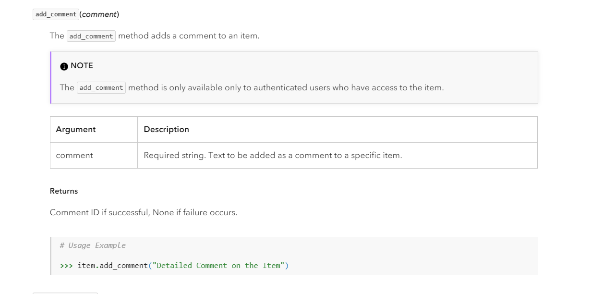
8.  **Returns**
   * Use the _:return:_ directive for the return statements on classes and methods
   * Make sure there is a blank space between the directive and the preceding portion of the docstring,
   as well as before the beginning of the next entry in the file
   * **Documentation syntax**
     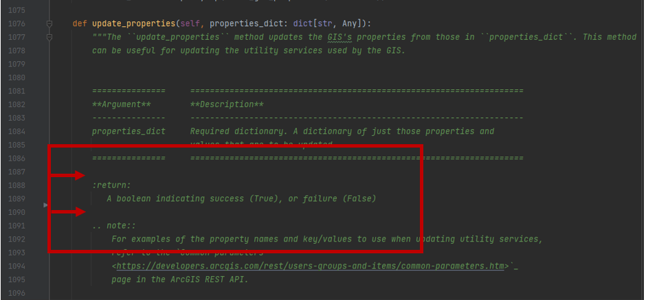
   * **Documentation output**

     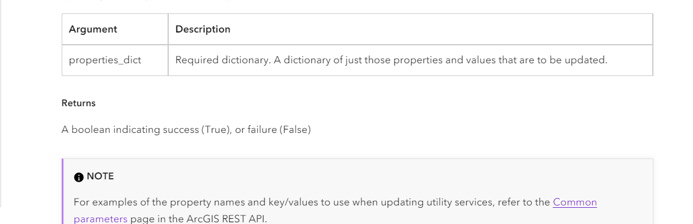
9. **Images**
  * add images you want to use to the following directory: 
     `/docs/api_ref/source/_static/images` directory
  * add a relative link to that location after the `image::` directive
  * **Docstring Syntax**  .. image:: \<path_to_image\>
  * **Docstring Example**
    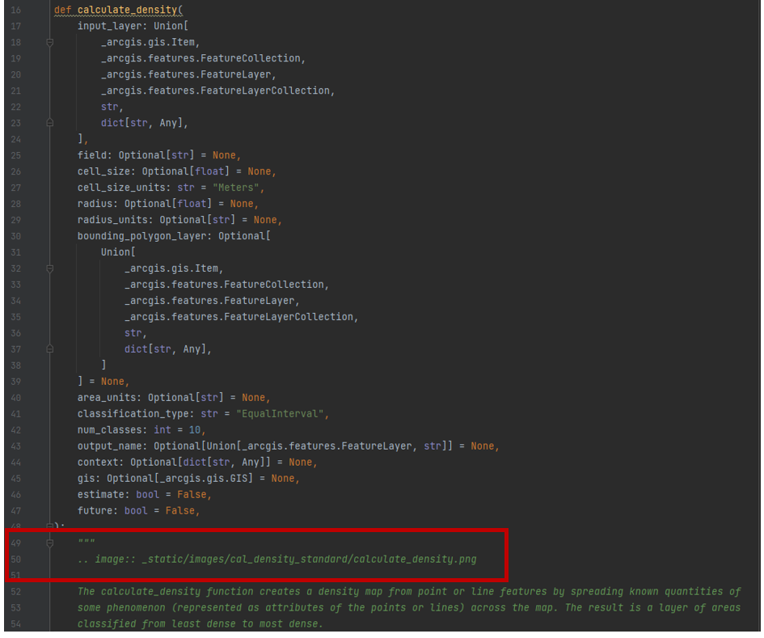
  * **Docstring Output**
    
    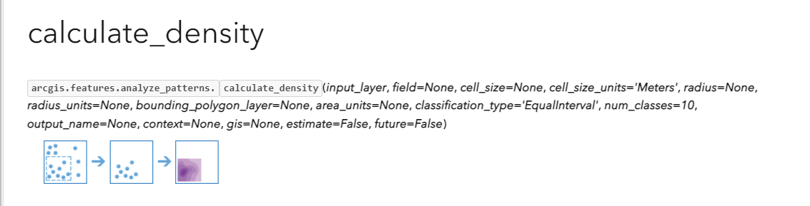
